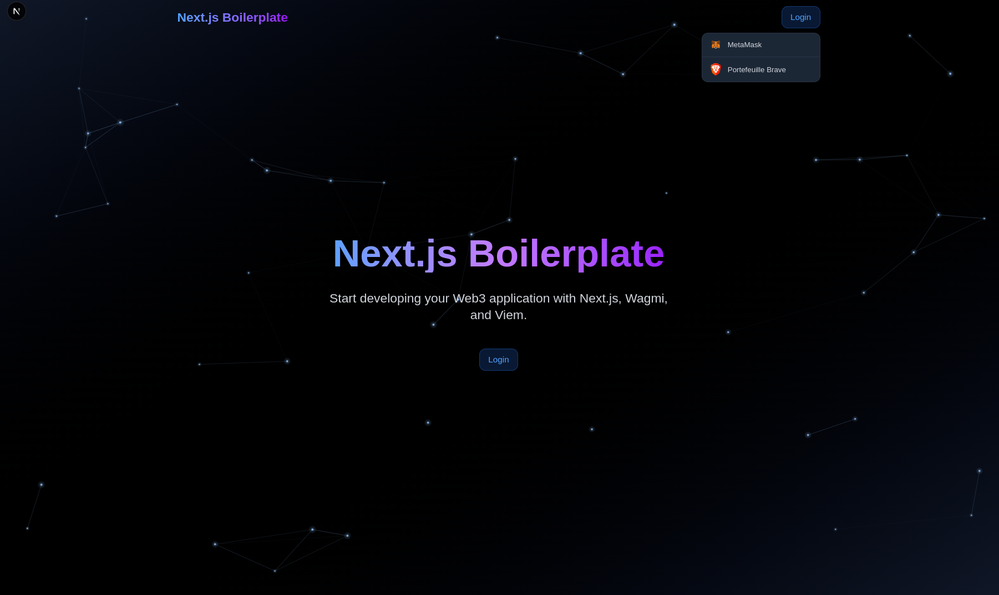

# Next.js Web3 Boilerplate 🚀

<br/>



<br/>

### A modern boilerplate for building Web3 applications with Next.js 15, Wagmi v3, and Viem.

<br/>

## 🌟 Features

- ⚡️ **Next.js 15**
- 🎨 **TailwindCSS**
- 🔐 **Web3 Authentication** with multi-wallet support
- 🔄 **Global State** with Wagmi v3
- 🌐 **Multi-network Support**

## 🛠 Technologies

- [Next.js 15](https://nextjs.org/)
- [Wagmi v3](https://wagmi.sh/)
- [Viem](https://viem.sh/)
- [TailwindCSS](https://tailwindcss.com/)
- [TypeScript](https://www.typescriptlang.org/)

<br/>

## 🚀 Quick Start

```bash
# Clone the repo
git clone https://github.com/MathysCogne/nextjs_boilerplate_web3-auth_metamask

# Install dependencies
pnpm install

# Start development server
pnpm dev
```

<br/>

## 🔧 Configuration

### Environment Variables

Create a `.env` file at the root of your project:

```bash
# App
NEXT_PUBLIC_INFURA_API_KEY = your_api_key_infura
```

<br/>

### Network Configuration

The application supports multiple networks out of the box. Networks are configured in three main files:

#### 1. `constants/networks.ts`
This file defines the network metadata used throughout the application:

```typescript
export const NETWORKS = {
  mainnet: {
    chainId: 1,
    name: 'Ethereum',
    currency: 'ETH',
    explorerUrl: 'https://etherscan.io'
  },
  arbitrum: {
    chainId: 42161,
    name: 'Arbitrum One',
    currency: 'ETH',
    explorerUrl: 'https://arbiscan.io'
  }
  // Add your custom networks here
} as const;
```

<br/>

#### 2. `lib/constants.ts`
This file configures the RPC endpoints for each network. We use Infura by default:

```typescript
export const INFURA_ENDPOINTS = {
  MAINNET: `https://mainnet.infura.io/v3/${INFURA_API_KEY}`,
  ARBITRUM: `https://arbitrum-mainnet.infura.io/v3/${INFURA_API_KEY}`,
  OPTIMISM: `https://optimism-mainnet.infura.io/v3/${INFURA_API_KEY}`,
  POLYGON: `https://polygon-mainnet.infura.io/v3/${INFURA_API_KEY}`,
  LINEA_SEPOLIA: `https://lineasepolia.infura.io/v3/${INFURA_API_KEY}`,
  // Add new network endpoints here
} as const;
```

<br/>

#### 3. `lib/wagmi.ts`
This file configures the Wagmi client with the supported networks:

```typescript
import { mainnet, arbitrum, optimism, polygon, lineaSepolia } from 'wagmi/chains';

export const config = createConfig({
  chains: [mainnet, arbitrum, optimism, polygon, lineaSepolia],
  // ... other config
});
```

<br/>

### Adding a New Network

To add support for a new network, follow these steps:

1. **Import the Chain Configuration**
   - If it's a standard chain, import it from `wagmi/chains`
   - For custom chains, define your own chain configuration following the Wagmi chain format

2. **Add RPC Endpoint**
   In `lib/constants.ts`, add the RPC endpoint:
   ```typescript
   export const INFURA_ENDPOINTS = {
     // ... existing endpoints
     NEW_NETWORK: `https://new-network.infura.io/v3/${INFURA_API_KEY}`,
   } as const;
   ```

3. **Update Wagmi Configuration**
   In `lib/wagmi.ts`:
   ```typescript
   import { newNetwork } from 'wagmi/chains'; // or your custom chain

   export const config = createConfig({
     chains: [...existingChains, newNetwork],
     transports: {
       // ... existing transports
       [newNetwork.id]: http(INFURA_ENDPOINTS.NEW_NETWORK),
     },
   });
   ```

4. **Add Network Metadata**
   In `constants/networks.ts`:
   ```typescript
   export const NETWORKS = {
     // ... existing networks
     newNetwork: {
       chainId: 12345,
       name: 'New Network',
       currency: 'TOKEN',
       explorerUrl: 'https://explorer.newnetwork.com'
     },
   } as const;
   ```

5. **Testing**
   After adding a new network:
   - Test network switching functionality
   - Verify RPC connections
   - Test transactions
   - Check explorer links
   - Verify network information display in the UI

<br/>
